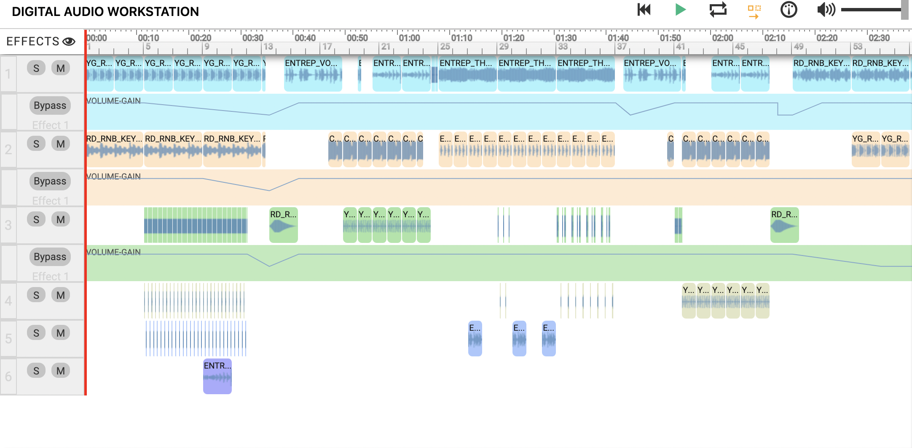

# EarSketch-project
Welcome to my EarSketch project repository!
Here, you will find a file that I created for the EarSketch competition.

  

# What is EarSketch?
EarSketch is a free educational based programming environnment that uses Python or Javascript to create and mix music. You essentially take different samples from the variety of choices offered by EarSketch, put them into the digital audio workstation (DAW) and create a song that will be submitted to the competition. 

In order to run this song, you must use the earsketch website. The earsketch module cannot be installed or downloaded using something like pip in the terminal.

# Purpose
The purpose of this project was to create a song that is coded either in Python or Javascript, contains an underlying theme of racial equity and must be submitted before the due date. My CTS teacher presented EarSketch to the class and I thought that I would like it since I enjoy listening to music and always wanted to try and make music myself. 

# Built With
* [EarSketch](https://earsketch.gatech.edu/landing/#/)
* Python

# Link to website
To listen to the song, press the following link
https://earsketch.gatech.edu/earsketch2/?sharing=cz0RQaBOrmFs195zJyK_ozKjn8sxuZJ9zGv0HDvHKnA.

# Author(s) and credits
Project created by Nathan Lapak.
